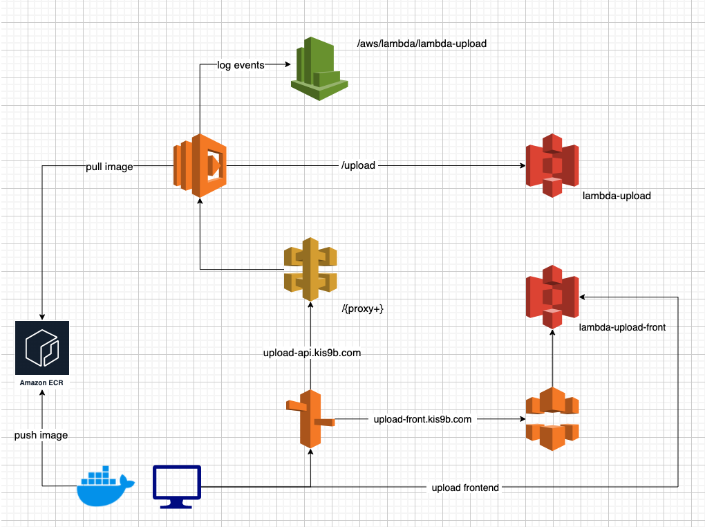

## edit .env

```
mv .env.default .env
```

## serve api

```
docker compose up
```

## serve frontend example

```bash
cd ./web
npx live-server .
```

## deploy infrastructure

```bash
cd ./infrastructure/terraform
# edit backend
vi backend.tf
vi variables.tf
terraform init
terraform apply
```

## update image

```bash
cd ./infrastructure/terraform
terraform apply --replace='null_resource.ecr_image'
```

## todo frontend

```bash
cd ./web
aws s3 sync ./ s3://kis9a-lambda-todo-front --delete

## invalidate cloudfront cache
## replace xxxxxxxxxxxxxx your distribution id
aws cloudfront create-invalidation --distribution-id xxxxxxxxxxxxxx --paths "/*"
```
